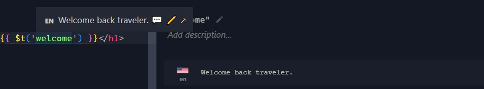

# Internationalization

Powered by [unplugin-vue-i18n](https://github.com/intlify/bundle-tools/tree/main/packages/unplugin-vue-i18n) and [lokalise.i18n-ally](https://github.com/lokalise/i18n-ally) VSCode extension.

Define locale keys inside language files in `src/locales/` directory, then those keys will be interactive thanks to the extension.



## How to use in Vue templates

```html
<h1>{{ $t('welcome') }}</h1>
```

## How to use in composables

```ts
const { t } = useI18n();
const message = t('welcome');
```
